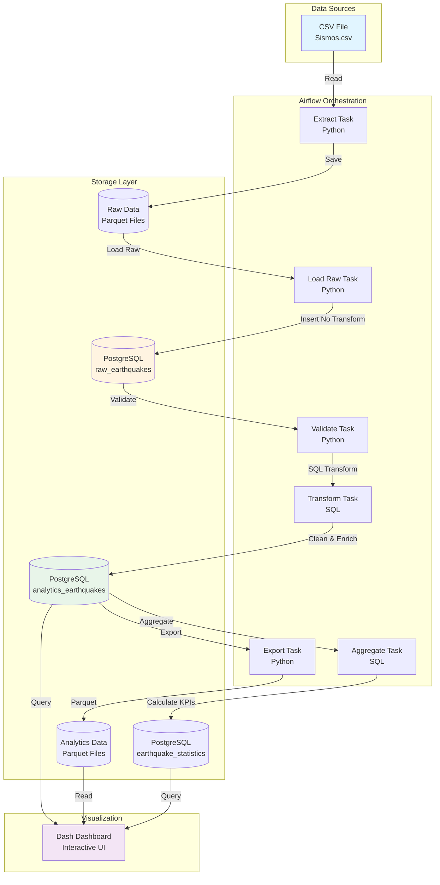
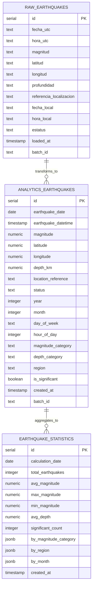
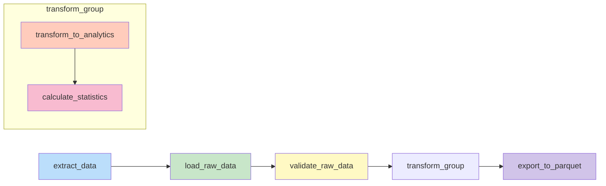
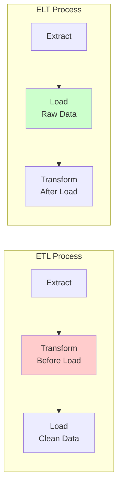
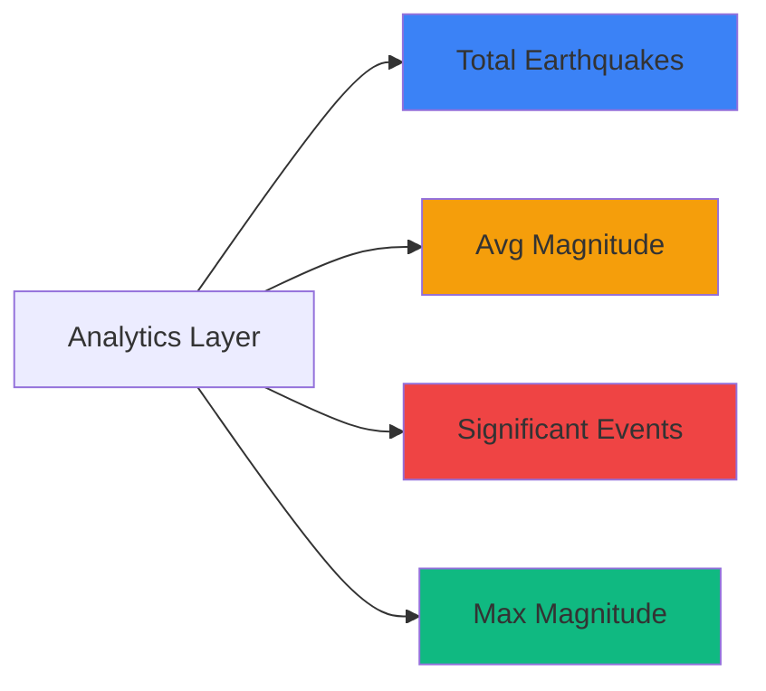

# 🌍 Earthquake ELT Pipeline for Social Impact Analysis

A comprehensive ELT (Extract-Load-Transform) data pipeline built with Apache Airflow for analyzing earthquake data in Mexico, demonstrating the power of modern data engineering for disaster preparedness and policy-making.


## 📋 Table of Contents

- [Project Overview](#project-overview)
- [Social & Environmental Impact](#social--environmental-impact)
- [Architecture](#architecture)
- [Technology Stack](#technology-stack)
- [Quick Start](#quick-start)
- [Project Structure](#project-structure)
- [ELT Pipeline Explanation](#elt-pipeline-explanation)
- [Dashboard Features](#dashboard-features)
- [Screenshots](#screenshots)
- [Development](#development)
- [Troubleshooting](#troubleshooting)
- [Author](#author)
- [License](#license)

## 🎯 Project Overview

This project implements a complete ELT (Extract-Load-Transform) pipeline for earthquake data analysis, showcasing:

- **Extract**: Automated data extraction from CSV sources (simulating real-time seismic data feeds)
- **Load**: Raw data loading into PostgreSQL without transformation (preserving data integrity)
- **Transform**: In-database transformations using SQL (creating analytics-ready datasets)
- **Orchestration**: Apache Airflow for workflow management and scheduling
- **Visualization**: Interactive Dash dashboard for insights and analysis

## 🌱 Social & Environmental Impact

### Real-World Problem
Mexico is located in one of the most seismically active regions in the world. Understanding earthquake patterns is crucial for:
- **Public Safety**: Early warning systems and evacuation planning
- **Infrastructure**: Building code enforcement and urban planning
- **Policy Making**: Resource allocation for disaster response
- **Research**: Understanding seismic patterns and predicting future events

### Who Benefits?
- **Civil Protection Agencies**: Data-driven emergency response planning
- **Urban Planners**: Informed decisions about construction zones
- **Policy Makers**: Evidence-based resource allocation
- **Researchers**: Historical data analysis and pattern recognition
- **Citizens**: Access to transparent seismic information

### Why ELT?
1. **Data Preservation**: Raw seismic data must be preserved exactly as received for audit trails and scientific accuracy
2. **Continuous Growth**: New earthquakes occur daily, requiring incremental data loads
3. **Evolving Analysis**: As seismology advances, new transformations can be applied to existing raw data without re-extraction
4. **Performance**: In-database transformations leverage PostgreSQL's power for large-scale aggregations
5. **Flexibility**: Data scientists can create new features from raw data without affecting production pipelines

## 🏗️ Architecture

### System Architecture Diagram



### ELT Data Flow

```mermaid
sequenceDiagram
    participant CSV as CSV File
    participant Airflow as Airflow Scheduler
    participant Raw as Raw Layer
    participant DW as Data Warehouse
    participant Analytics as Analytics Layer
    participant Dashboard as Dashboard
    
    Note over Airflow: Daily Schedule Triggered
    
    Airflow->>CSV: 1. Extract Data
    CSV-->>Airflow: Raw Records
    
    Airflow->>Raw: 2. Save to Parquet
    Raw-->>Airflow: Batch ID
    
    Airflow->>DW: 3. Load Raw (NO TRANSFORM!)
    Note over DW: raw_earthquakes table<br/>All columns as TEXT
    DW-->>Airflow: Records Loaded
    
    Airflow->>DW: 4. Validate Count
    DW-->>Airflow: Validation OK
    
    Airflow->>DW: 5. Transform (SQL)
    Note over DW: Clean, Type Cast,<br/>Feature Engineering
    DW->>Analytics: Create analytics_earthquakes
    
    Airflow->>DW: 6. Aggregate (SQL)
    DW->>Analytics: Create earthquake_statistics
    
    Airflow->>Analytics: 7. Export to Parquet
    Analytics-->>Airflow: Export Complete
    
    Dashboard->>Analytics: 8. Query Data
    Analytics-->>Dashboard: Display Insights
```



### Database Schema



### Airflow DAG Structure



## 🛠️ Technology Stack

| Category | Technology | Version | Purpose |
|----------|-----------|---------|---------|
| **Orchestration** | Apache Airflow | 2.7.3 | Workflow management & scheduling |
| **Database** | PostgreSQL | 13 | Data warehouse & transformations |
| **Data Processing** | Pandas | 2.1.3 | Data manipulation |
| **Storage Format** | Parquet | - | Efficient columnar storage |
| **Visualization** | Dash | 2.14.2 | Interactive dashboard |
| **Plotting** | Plotly | 5.18.0 | Data visualizations |
| **Containerization** | Docker | 20.10+ | Container orchestration |
| **Language** | Python | 3.10 | Primary development language |

## 🚀 Quick Start

### Prerequisites
- Docker Desktop 20.10+ installed
- At least 4GB RAM available
- 10GB free disk space
- Git (optional)

### Installation

```bash
# 1. Clone the repository
git clone <your-repo-url>
cd earthquake-elt-pipeline

# 2. Place your CSV file
cp /path/to/Sismos.csv data/

# 3. Run deployment script
chmod +x deploy.sh
./deploy.sh
```

The script will automatically:
- ✅ Check prerequisites
- ✅ Build Docker images
- ✅ Start all services
- ✅ Initialize database
- ✅ Configure Airflow connections

### Access Points

| Service | URL | Credentials |
|---------|-----|-------------|
| **Airflow UI** | http://localhost:8080 | admin / admin |
| **Dashboard** | http://localhost:8050 | No auth required |
| **PostgreSQL** | localhost:5432 | dwuser / dwpassword |

### First Run

1. Open Airflow UI: http://localhost:8080
2. Login with `admin` / `admin`
3. Find DAG: `earthquake_elt_pipeline`
4. Toggle to enable the DAG
5. Click "Trigger DAG" (▶ button)
6. Wait for completion (all tasks green ✓)
7. Open Dashboard: http://localhost:8050

## 📁 Project Structure

```
earthquake-elt-pipeline/
├── dags/
│   └── earthquake_elt_dag.py          # Main ELT pipeline DAG
├── dashboard/
│   └── app.py                          # Dash dashboard application
├── data/
│   ├── raw/                            # Raw Parquet files (partitioned)
│   ├── analytics/                      # Transformed Parquet files
│   └── Sismos.csv                      # Source data (place here)
├── config/
│   ├── init_db.sql                     # Database initialization script
│   └── setup_airflow_connection.sh    # Airflow connection setup
├── docs/
│   ├── JUSTIFICATION.md                # Social impact justification
│   ├── SETUP.md                        # Detailed setup guide
│   └── screenshots/                    # Project screenshots
├── logs/                               # Airflow logs
├── plugins/                            # Custom Airflow plugins
├── docker-compose.yml                  # Multi-container orchestration
├── Dockerfile                          # Custom Airflow image
├── requirements.txt                    # Python dependencies
├── deploy.sh                           # Automated deployment script
├── .env                                # Environment variables
├── .gitignore                          # Git ignore rules
└── README.md                           # This file
```

## 🔄 ELT Pipeline Explanation

### What is ELT?

**ELT** (Extract-Load-Transform) differs from **ETL** (Extract-Transform-Load):



| Aspect | ETL | ELT |
|--------|-----|-----|
| **Transform Location** | Application layer (Python) | Database layer (SQL) |
| **Raw Data** | Not preserved | Preserved in raw tables |
| **Performance** | Limited by app resources | Leverages database power |
| **Flexibility** | Re-extract for new transforms | Transform from existing raw |
| **Best For** | Small datasets, legacy systems | Large datasets, modern warehouses |

### Why ELT for Earthquakes?

1. **Immutable Raw Data**: Original seismic readings preserved for audit and reanalysis
2. **Performance**: PostgreSQL processes millions of rows faster than Python
3. **Flexibility**: New transformations don't require re-extraction
4. **Scalability**: Partitioned raw data, incremental loads
5. **Scientific Integrity**: Raw measurements remain unchanged

### Pipeline Stages

#### Stage 1: Extract
```python
# Read CSV and partition by batch
df = pd.read_csv('Sismos.csv')
batch_id = datetime.now().strftime('%Y%m%d_%H%M%S')
df.to_parquet(f'raw/earthquakes_{batch_id}.parquet')
```

#### Stage 2: Load Raw (Key ELT Principle!)
```python
# Load data EXACTLY as it comes - NO transformation
# All columns remain as TEXT to preserve original format
df.to_sql('raw_earthquakes', engine, if_exists='append')
```

#### Stage 3: Transform (In-Database SQL)
```sql
-- Clean and transform INSIDE PostgreSQL
INSERT INTO analytics_earthquakes
SELECT 
    TO_DATE(fecha_utc, 'DD/MM/YYYY') as earthquake_date,
    CAST(magnitud AS NUMERIC(3,1)) as magnitude,
    -- Feature engineering
    CASE 
        WHEN magnitude >= 7.0 THEN 'Great'
        WHEN magnitude >= 6.0 THEN 'Major'
        WHEN magnitude >= 5.0 THEN 'Strong'
        ELSE 'Moderate'
    END as magnitude_category
FROM raw_earthquakes
WHERE batch_id = '20250127_143000';
```

### Error Handling & Scaling Features

#### ✅ Error Handling
- **Automatic Retries**: 3 retries with exponential backoff
- **Validation Tasks**: Verify record counts match
- **Comprehensive Logging**: Track every operation
- **Alerts**: Can be configured for failures

#### ✅ Scaling Strategies
- **Parquet Format**: 50-80% smaller than CSV, columnar for analytics
- **Partitioning**: Raw data partitioned by batch/date
- **Incremental Loads**: Only process new data
- **SQL Transformations**: Leverage database indexes and optimization
- **Parallel Tasks**: Airflow can run multiple tasks concurrently

## 📊 Dashboard Features

### Key Performance Indicators (KPIs)



### Visualizations

1. **Magnitude Distribution**: Bar chart categorizing earthquakes by intensity
2. **Regional Analysis**: Horizontal bar chart of top 10 seismic regions
3. **Temporal Patterns**: Line chart showing earthquake frequency over years
4. **Geographic Map**: Interactive Mapbox visualization with magnitude/location
5. **Depth Analysis**: Pie chart of shallow/intermediate/deep earthquakes

### Interactive Features
- 🎚️ **Magnitude Range Slider**: Filter by earthquake intensity
- 🗺️ **Region Dropdown**: Multi-select regional filter
- 🔄 **Auto-Refresh**: Updates every 60 seconds
- 📊 **Hover Details**: Contextual information on chart hover

### Insights Engine
The dashboard automatically generates insights:
- Most seismically active regions
- Average depth patterns (relates to surface impact)
- Significant event detection (magnitude ≥5.0 or depth <50km)
- Policy recommendations based on patterns

## 📸 Screenshots

### Airflow DAG Execution

*ELT pipeline showing Extract → Load → Transform flow*

### Raw vs Analytics Tables

*Raw table (TEXT) vs Analytics table (typed & enriched)*

### Interactive Dashboard

*Real-time seismic data visualization*

### Regional Analysis

*Most active seismic regions in Mexico*

> **Note**: Place your screenshots in `docs/screenshots/` directory

## 🔧 Development

### Adding Custom Transformations

1. **Edit the DAG**:
```python
# In dags/earthquake_elt_dag.py
TRANSFORM_SQL = """
INSERT INTO analytics_earthquakes
SELECT 
    -- Add your new transformations here
    CASE 
        WHEN your_condition THEN 'Your_Category'
    END as your_new_column
FROM raw_earthquakes;
"""
```

2. **Restart Scheduler**:
```bash
docker-compose restart airflow-scheduler
```

3. **Trigger DAG**:
- Open Airflow UI
- Click "Trigger DAG"

### Customizing the Dashboard

1. **Edit Dashboard Code**:
```python
# In dashboard/app.py
def fetch_custom_data():
    query = """
    SELECT custom_column 
    FROM analytics_earthquakes
    WHERE your_filter
    """
    return pd.read_sql(query, engine)
```

2. **Restart Dashboard**:
```bash
docker-compose restart dashboard
```

### Database Access

```bash
# PostgreSQL CLI
docker-compose exec postgres psql -U dwuser -d earthquake_dw

# View raw data
\x  # Expanded display
SELECT * FROM raw_earthquakes LIMIT 1;

# View analytics data
SELECT 
    earthquake_date,
    magnitude,
    magnitude_category,
    region 
FROM analytics_earthquakes 
ORDER BY magnitude DESC 
LIMIT 10;

# Check statistics
SELECT * FROM earthquake_statistics ORDER BY calculation_date DESC LIMIT 1;
```

### Useful Commands

```bash
# View all services
docker-compose ps

# View logs
docker-compose logs -f airflow-scheduler
docker-compose logs -f dashboard

# Restart specific service
docker-compose restart airflow-webserver

# Rebuild images
docker-compose build --no-cache

# Access container shell
docker-compose exec airflow-webserver bash
docker-compose exec postgres bash

# Stop all services
docker-compose down

# Remove all data (CAREFUL!)
docker-compose down -v
```

## 🐛 Troubleshooting

### Common Issues and Solutions

#### ❌ Issue 1: Port Already in Use

**Error**: `Bind for 0.0.0.0:8080 failed: port is already allocated`

**Solution**:
```bash
# macOS/Linux - Find and kill process
lsof -i :8080
kill -9 <PID>

# Windows - Find and kill process
netstat -ano | findstr :8080
taskkill /PID <PID> /F

# Or change port in docker-compose.yml
# Edit: ports: "8081:8080"
```

#### ❌ Issue 2: Services Won't Start

**Error**: `Container exits immediately`

**Solution**:
```bash
# Check logs for specific service
docker-compose logs postgres
docker-compose logs airflow-scheduler

# Common fixes:
# 1. Increase Docker memory (Docker Desktop → Settings → Resources)
# 2. Clean up and restart
docker-compose down -v
docker-compose up -d

# 3. Rebuild images
docker-compose build --no-cache
docker-compose up -d
```

#### ❌ Issue 3: Airflow Connection Error

**Error**: `Connection 'earthquake_dw' doesn't exist`

**Solution**:
```bash
# Recreate connection
docker-compose exec airflow-webserver airflow connections add 'earthquake_dw' \
    --conn-type 'postgres' \
    --conn-login 'dwuser' \
    --conn-password 'dwpassword' \
    --conn-host 'postgres' \
    --conn-port '5432' \
    --conn-schema 'earthquake_dw'

# Or run setup script
bash config/setup_airflow_connection.sh
```

#### ❌ Issue 4: CSV File Not Found

**Error**: `FileNotFoundError: /opt/airflow/data/Sismos.csv`

**Solution**:
```bash
# Verify file location and name (case-sensitive!)
ls -la data/Sismos.csv

# Must be exactly: data/Sismos.csv

# Check file permissions
chmod 644 data/Sismos.csv

# Restart services
docker-compose restart
```

#### ❌ Issue 5: Database Tables Not Created

**Error**: `relation "raw_earthquakes" does not exist`

**Solution**:
```bash
# Method 1: Recreate database
docker-compose down -v
docker-compose up -d

# Method 2: Manually run init script
docker-compose exec postgres psql -U postgres -d earthquake_dw -f /docker-entrypoint-initdb.d/init_db.sql

# Verify tables exist
docker-compose exec postgres psql -U dwuser -d earthquake_dw -c "\dt"
```

#### ❌ Issue 6: Dashboard Shows No Data

**Error**: Dashboard loads but charts are empty

**Solution**:
```bash
# 1. Check if pipeline ran successfully
# Open Airflow UI and verify all tasks are green

# 2. Verify data in database
docker-compose exec postgres psql -U dwuser -d earthquake_dw \
    -c "SELECT COUNT(*) FROM analytics_earthquakes;"

# 3. Check dashboard logs
docker-compose logs dashboard

# 4. Manually trigger DAG if not run yet
# Airflow UI → earthquake_elt_pipeline → Trigger DAG
```

#### ❌ Issue 7: Out of Memory (OOM)

**Error**: `Container killed (OOM)`

**Solution**:
```bash
# Check Docker memory allocation
docker stats

# Increase Docker memory:
# Docker Desktop → Settings → Resources → Memory → 6-8GB

# Reduce Airflow parallelism in docker-compose.yml:
environment:
  AIRFLOW__CORE__PARALLELISM: 8
  AIRFLOW__CORE__DAG_CONCURRENCY: 4
```

#### ❌ Issue 8: Slow Dashboard Performance

**Symptoms**: Dashboard takes long to load or refresh

**Solution**:
```bash
# 1. Check data volume
docker-compose exec postgres psql -U dwuser -d earthquake_dw \
    -c "SELECT COUNT(*) FROM analytics_earthquakes;"

# 2. Add database indexes (if not exists)
docker-compose exec postgres psql -U dwuser -d earthquake_dw -c "
CREATE INDEX IF NOT EXISTS idx_analytics_date ON analytics_earthquakes(earthquake_date);
CREATE INDEX IF NOT EXISTS idx_analytics_magnitude ON analytics_earthquakes(magnitude);
"

# 3. Limit dashboard query to recent data
# Edit dashboard/app.py and add:
# LIMIT 10000 to queries
```

### Health Check Commands

```bash
# ✅ Check all services are running
docker-compose ps

# ✅ Test PostgreSQL connection
docker-compose exec postgres pg_isready -U dwuser

# ✅ Test Airflow webserver
curl http://localhost:8080/health

# ✅ Test dashboard
curl http://localhost:8050

# ✅ Check disk space
df -h

# ✅ Check Docker resources
docker system df
```

### Getting Help

1. **Check logs first**:
   ```bash
   docker-compose logs -f
   ```

2. **Review documentation**:
   - [SETUP.md](docs/SETUP.md) - Detailed setup guide
   - [JUSTIFICATION.md](docs/JUSTIFICATION.md) - Project rationale

3. **Common resources**:
   - [Airflow Documentation](https://airflow.apache.org/docs/)
   - [PostgreSQL Docs](https://www.postgresql.org/docs/)
   - [Dash Documentation](https://dash.plotly.com/)

4. **Report issues**:
   - Include error logs
   - Describe steps to reproduce
   - Mention your OS and Docker version

## 👤 Author

**S3RG10-B4RR3R4**

- GitHub: [@S3RG10-B4RR3R4](https://github.com/S3RG10-B4RR3R4)
- Project: Earthquake ELT Pipeline for Social Impact
- Purpose: Educational project demonstrating modern data engineering for disaster preparedness

### Project Context
This project was developed as part of a data engineering course focused on:
- ELT pipeline design and implementation
- Apache Airflow orchestration
- Social and environmental impact through data
- Modern data visualization techniques

## 📚 References

- **Seismic Data**: National Seismological Service of Mexico (SSN)
- **ELT Best Practices**: Data Engineering community standards
- **Disaster Preparedness**: CENAPRED (National Center for Disaster Prevention)
- **Data Visualization**: Plotly and Dash documentation

## 🤝 Contributing

This is an educational project, but suggestions are welcome!

1. Fork the repository
2. Create a feature branch: `git checkout -b feature/amazing-feature`
3. Commit changes: `git commit -m 'Add amazing feature'`
4. Push to branch: `git push origin feature/amazing-feature`
5. Open a Pull Request

## 📄 License

This project is for educational purposes. Feel free to use it for learning and academic projects.

---

## 🎓 Learning Outcomes

By studying this project, you will understand:

- ✅ **ELT vs ETL**: When and why to use each approach
- ✅ **Apache Airflow**: DAG creation, task dependencies, scheduling
- ✅ **Data Warehousing**: Raw vs analytics layers, SQL transformations
- ✅ **Containerization**: Docker Compose for multi-service orchestration
- ✅ **Data Visualization**: Building interactive dashboards with Dash
- ✅ **Social Impact**: Using data engineering for real-world problems

---

## 🌟 Key Takeaways

> **"In the face of natural disasters, data is not just numbers—it's lives saved, buildings protected, and communities made resilient."**

This project demonstrates:
1. **Technical Excellence**: Production-ready ELT pipeline with error handling and scaling
2. **Social Responsibility**: Technology serving public safety and disaster preparedness
3. **Best Practices**: Following industry standards for data engineering
4. **Documentation**: Comprehensive guides for setup, usage, and troubleshooting

---

**Built with ❤️ for disaster preparedness and social impact**

**Made by S3RG10-B4RR3R4 | 2025**
