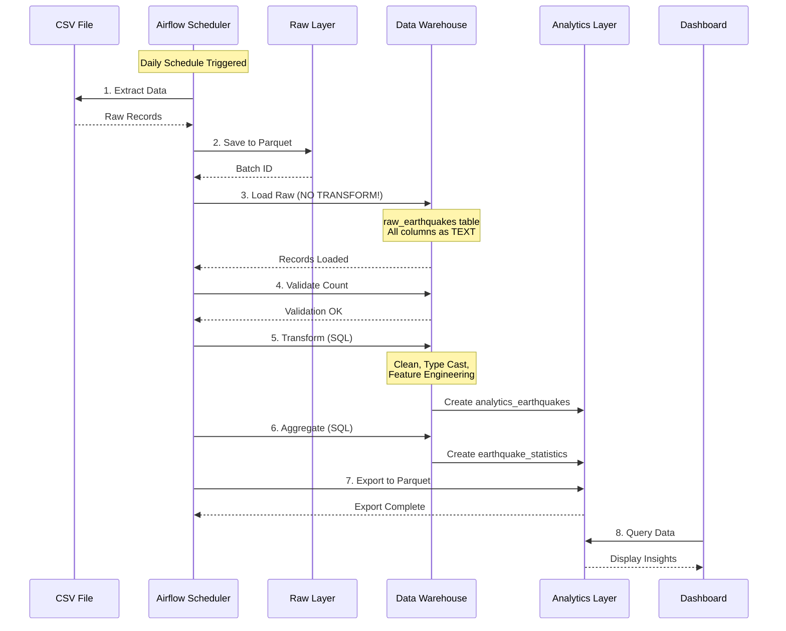

# 🌍 Earthquake ELT Pipeline for Social Impact Analysis

<div align="center">


[](LICENSE)
[](https://github.com/S3RG10-B4RR3R4)

</div>

---

A comprehensive ELT (Extract-Load-Transform) data pipeline built with Apache Airflow for analyzing earthquake data in Mexico, demonstrating the power of modern data engineering for disaster preparedness and policy-making.

## 📋 Table of Contents

- [Project Overview](#project-overview)
- [Social & Environmental Impact](#social--environmental-impact)
- [Architecture](#architecture)
- [Technology Stack](#technology-stack)
- [Quick Start](#quick-start)
- [Project Structure](#project-structure)
- [ELT Pipeline Explanation](#elt-pipeline-explanation)
- [Dashboard Features](#dashboard-features)
- [Development](#development)
- [Troubleshooting](#troubleshooting)
- [Author](#author)

## 🎯 Project Overview

This project implements a complete ELT (Extract-Load-Transform) pipeline for earthquake data analysis, showcasing:

- **Extract**: Automated data extraction from CSV sources (simulating real-time seismic data feeds)
- **Load**: Raw data loading into PostgreSQL without transformation (preserving data integrity)
- **Transform**: In-database transformations using SQL (creating analytics-ready datasets)
- **Orchestration**: Apache Airflow for workflow management and scheduling
- **Visualization**: Interactive Dash dashboard for insights and analysis

## 🌱 Social & Environmental Impact

### Real-World Problem
Mexico is located in one of the most seismically active regions in the world. Understanding earthquake patterns is crucial for:
- **Public Safety**: Early warning systems and evacuation planning
- **Infrastructure**: Building code enforcement and urban planning
- **Policy Making**: Resource allocation for disaster response
- **Research**: Understanding seismic patterns and predicting future events

### Who Benefits?
- **Civil Protection Agencies**: Data-driven emergency response planning
- **Urban Planners**: Informed decisions about construction zones
- **Policy Makers**: Evidence-based resource allocation
- **Researchers**: Historical data analysis and pattern recognition
- **Citizens**: Access to transparent seismic information

### Why ELT?
1. **Data Preservation**: Raw seismic data must be preserved exactly as received for audit trails and scientific accuracy
2. **Continuous Growth**: New earthquakes occur daily, requiring incremental data loads
3. **Evolving Analysis**: As seismology advances, new transformations can be applied to existing raw data without re-extraction
4. **Performance**: In-database transformations leverage PostgreSQL's power for large-scale aggregations
5. **Flexibility**: Data scientists can create new features from raw data without affecting production pipelines

## 🏗️ Architecture

### System Architecture Diagram


### ELT Data Flow



### Database Schema


### Airflow DAG Structure


## 🛠️ Technology Stack

<div align="center">

| Technology | Version | Purpose | Badge |
|:----------:|:-------:|:-------:|:-----:|
| **Python** | 3.10 | Primary Language |  |
| **Apache Airflow** | 2.7.3 | Workflow Orchestration |  |
| **PostgreSQL** | 13 | Data Warehouse |  |
| **Docker** | 20.10+ | Containerization |  |
| **Pandas** | 2.1.3 | Data Processing |  |
| **Dash** | 2.14.2 | Dashboard Framework |  |
| **Plotly** | 5.18.0 | Data Visualization |  |
| **Parquet** | - | Storage Format |  |
| **SQLAlchemy** | 1.4.50 | ORM & DB Connection |  |

</div>

## 🚀 Quick Start

### Prerequisites

<div align="center">


</div>

- Docker Desktop 20.10+ installed
- At least 4GB RAM available
- 10GB free disk space
- Git (optional)

### Installation

```bash
# 1. Clone the repository
git clone https://github.com/S3RG10-B4RR3R4/earthquake-elt-pipeline.git
cd earthquake-elt-pipeline

# 2. Place your CSV file
cp /path/to/Sismos.csv data/

# 3. Run deployment script
chmod +x deploy.sh
./deploy.sh
```

The script will automatically:
- ✅ Check prerequisites
- ✅ Build Docker images
- ✅ Start all services
- ✅ Initialize database
- ✅ Configure Airflow connections

### Access Points

<div align="center">

| Service | URL | Credentials |
|:-------:|:---:|:-----------:|
| 🌐 **Airflow UI** | http://localhost:8080 | `admin` / `admin` |
| 📊 **Dashboard** | http://localhost:8050 | No auth required |
| 🗄️ **PostgreSQL** | `localhost:5432` | `dwuser` / `dwpassword` |

</div>

### First Run

1. Open Airflow UI: http://localhost:8080
2. Login with `admin` / `admin`
3. Find DAG: `earthquake_elt_pipeline`
4. Toggle to enable the DAG
5. Click "Trigger DAG" (▶ button)
6. Wait for completion (all tasks green ✓)
7. Open Dashboard: http://localhost:8050

## 📁 Project Structure

```
earthquake-elt-pipeline/
├── 🗂️ dags/
│   └── earthquake_elt_dag.py          # Main ELT pipeline DAG
├── 📊 dashboard/
│   └── app.py                          # Dash dashboard application
├── 💾 data/
│   ├── raw/                            # Raw Parquet files (partitioned)
│   ├── analytics/                      # Transformed Parquet files
│   └── Sismos.csv                      # Source data (place here)
├── ⚙️ config/
│   ├── init_db.sql                     # Database initialization script
│   └── setup_airflow_connection.sh    # Airflow connection setup
├── 📚 docs/
│   ├── JUSTIFICATION.md                # Social impact justification
│   ├── SETUP.md                        # Detailed setup guide
│   └── screenshots/                    # Project screenshots
├── 📝 logs/                            # Airflow logs
├── 🔌 plugins/                         # Custom Airflow plugins
├── 🐳 docker-compose.yml               # Multi-container orchestration
├── 🐳 Dockerfile                       # Custom Airflow image
├── 📦 requirements.txt                 # Python dependencies
├── 🚀 deploy.sh                        # Automated deployment script
├── 🔐 .env                             # Environment variables
├── 🚫 .gitignore                       # Git ignore rules
└── 📖 README.md                        # This file
```

## 🔄 ELT Pipeline Explanation

### What is ELT?

**ELT** (Extract-Load-Transform) differs from **ETL** (Extract-Transform-Load):


<div align="center">

| Aspect | ETL | ELT |
|:------:|:---:|:---:|
| **Transform Location** | Application layer (Python) | Database layer (SQL) |
| **Raw Data** | ❌ Not preserved | ✅ Preserved in raw tables |
| **Performance** | ⚠️ Limited by app resources | ⚡ Leverages database power |
| **Flexibility** | 🔄 Re-extract for new transforms | ♻️ Transform from existing raw |
| **Best For** | Small datasets, legacy systems | Large datasets, modern warehouses |

</div>

### Why ELT for Earthquakes?

1. **Immutable Raw Data**: Original seismic readings preserved for audit and reanalysis
2. **Performance**: PostgreSQL processes millions of rows faster than Python
3. **Flexibility**: New transformations don't require re-extraction
4. **Scalability**: Partitioned raw data, incremental loads
5. **Scientific Integrity**: Raw measurements remain unchanged

### Pipeline Stages

#### Stage 1: Extract 📥
```python
# Read CSV and partition by batch
df = pd.read_csv('Sismos.csv')
batch_id = datetime.now().strftime('%Y%m%d_%H%M%S')
df.to_parquet(f'raw/earthquakes_{batch_id}.parquet')
```

#### Stage 2: Load Raw 💾 (Key ELT Principle!)
```python
# Load data EXACTLY as it comes - NO transformation
# All columns remain as TEXT to preserve original format
df.to_sql('raw_earthquakes', engine, if_exists='append')
```

#### Stage 3: Transform 🔄 (In-Database SQL)
```sql
-- Clean and transform INSIDE PostgreSQL
INSERT INTO analytics_earthquakes
SELECT 
    TO_DATE(fecha_utc, 'DD/MM/YYYY') as earthquake_date,
    CAST(magnitud AS NUMERIC(3,1)) as magnitude,
    -- Feature engineering
    CASE 
        WHEN magnitude >= 7.0 THEN 'Great'
        WHEN magnitude >= 6.0 THEN 'Major'
        WHEN magnitude >= 5.0 THEN 'Strong'
        ELSE 'Moderate'
    END as magnitude_category
FROM raw_earthquakes
WHERE batch_id = '20250127_143000';
```

### Error Handling & Scaling Features

#### ✅ Error Handling
- **Automatic Retries**: 3 retries with exponential backoff
- **Validation Tasks**: Verify record counts match
- **Comprehensive Logging**: Track every operation
- **Alerts**: Can be configured for failures

#### ✅ Scaling Strategies
- **Parquet Format**: 50-80% smaller than CSV, columnar for analytics
- **Partitioning**: Raw data partitioned by batch/date
- **Incremental Loads**: Only process new data
- **SQL Transformations**: Leverage database indexes and optimization
- **Parallel Tasks**: Airflow can run multiple tasks concurrently

## 📊 Dashboard Features

### Key Performance Indicators (KPIs)

```mermaid
graph LR
    A[Analytics Layer] --> B[📊 Total Earthquakes]
    A --> C[📈 Avg Magnitude]
    A --> D[⚠️ Significant Events]
    A --> E[🔥 Max Magnitude]
    
    style B fill:#3b82f6
    style C fill:#f59e0b
    style D fill:#ef4444
    style E fill:#10b981
```



### Visualizations

1. **Magnitude Distribution** 📊: Bar chart categorizing earthquakes by intensity
2. **Regional Analysis** 🗺️: Horizontal bar chart of top 10 seismic regions
3. **Temporal Patterns** 📈: Line chart showing earthquake frequency over years
4. **Geographic Map** 🌍: Interactive Mapbox visualization with magnitude/location
5. **Depth Analysis** 🎯: Pie chart of shallow/intermediate/deep earthquakes

### Interactive Features
- 🎚️ **Magnitude Range Slider**: Filter by earthquake intensity
- 🗺️ **Region Dropdown**: Multi-select regional filter
- 🔄 **Auto-Refresh**: Updates every 60 seconds
- 📊 **Hover Details**: Contextual information on chart hover

### Insights Engine
The dashboard automatically generates insights:
- Most seismically active regions
- Average depth patterns (relates to surface impact)
- Significant event detection (magnitude ≥5.0 or depth <50km)
- Policy recommendations based on patterns

## 🔧 Development

### Adding Custom Transformations

1. **Edit the DAG**:
```python
# In dags/earthquake_elt_dag.py
TRANSFORM_SQL = """
INSERT INTO analytics_earthquakes
SELECT 
    -- Add your new transformations here
    CASE 
        WHEN your_condition THEN 'Your_Category'
    END as your_new_column
FROM raw_earthquakes;
"""
```

2. **Restart Scheduler**:
```bash
docker-compose restart airflow-scheduler
```

3. **Trigger DAG**:
- Open Airflow UI
- Click "Trigger DAG"

### Customizing the Dashboard

1. **Edit Dashboard Code**:
```python
# In dashboard/app.py
def fetch_custom_data():
    query = """
    SELECT custom_column 
    FROM analytics_earthquakes
    WHERE your_filter
    """
    return pd.read_sql(query, engine)
```

2. **Restart Dashboard**:
```bash
docker-compose restart dashboard
```

### Database Access

```bash
# PostgreSQL CLI
docker-compose exec postgres psql -U dwuser -d earthquake_dw

# View raw data
\x  # Expanded display
SELECT * FROM raw_earthquakes LIMIT 1;

# View analytics data
SELECT 
    earthquake_date,
    magnitude,
    magnitude_category,
    region 
FROM analytics_earthquakes 
ORDER BY magnitude DESC 
LIMIT 10;

# Check statistics
SELECT * FROM earthquake_statistics ORDER BY calculation_date DESC LIMIT 1;
```

### Useful Commands

```bash
# View all services
docker-compose ps

# View logs
docker-compose logs -f airflow-scheduler
docker-compose logs -f dashboard

# Restart specific service
docker-compose restart airflow-webserver

# Rebuild images
docker-compose build --no-cache

# Access container shell
docker-compose exec airflow-webserver bash
docker-compose exec postgres bash

# Stop all services
docker-compose down

# Remove all data (CAREFUL!)
docker-compose down -v
```

## 🐛 Troubleshooting

### Common Issues and Solutions

#### ❌ Issue 1: Port Already in Use

**Error**: `Bind for 0.0.0.0:8080 failed: port is already allocated`

**Solution**:
```bash
# macOS/Linux - Find and kill process
lsof -i :8080
kill -9 <PID>

# Windows - Find and kill process
netstat -ano | findstr :8080
taskkill /PID <PID> /F

# Or change port in docker-compose.yml
# Edit: ports: "8081:8080"
```

#### ❌ Issue 2: Services Won't Start

**Error**: `Container exits immediately`

**Solution**:
```bash
# Check logs for specific service
docker-compose logs postgres
docker-compose logs airflow-scheduler

# Common fixes:
# 1. Increase Docker memory (Docker Desktop → Settings → Resources)
# 2. Clean up and restart
docker-compose down -v
docker-compose up -d

# 3. Rebuild images
docker-compose build --no-cache
docker-compose up -d
```

#### ❌ Issue 3: Airflow Connection Error

**Error**: `Connection 'earthquake_dw' doesn't exist`

**Solution**:
```bash
# Recreate connection
docker-compose exec airflow-webserver airflow connections add 'earthquake_dw' \
    --conn-type 'postgres' \
    --conn-login 'dwuser' \
    --conn-password 'dwpassword' \
    --conn-host 'postgres' \
    --conn-port '5432' \
    --conn-schema 'earthquake_dw'

# Or run setup script
bash config/setup_airflow_connection.sh
```

#### ❌ Issue 4: CSV File Not Found

**Error**: `FileNotFoundError: /opt/airflow/data/Sismos.csv`

**Solution**:
```bash
# Verify file location and name (case-sensitive!)
ls -la data/Sismos.csv

# Must be exactly: data/Sismos.csv

# Check file permissions
chmod 644 data/Sismos.csv

# Restart services
docker-compose restart
```

#### ❌ Issue 5: Database Tables Not Created

**Error**: `relation "raw_earthquakes" does not exist`

**Solution**:
```bash
# Method 1: Recreate database
docker-compose down -v
docker-compose up -d

# Method 2: Manually run init script
docker-compose exec postgres psql -U postgres -d earthquake_dw -f /docker-entrypoint-initdb.d/init_db.sql

# Verify tables exist
docker-compose exec postgres psql -U dwuser -d earthquake_dw -c "\dt"
```

#### ❌ Issue 6: Dashboard Shows No Data

**Error**: Dashboard loads but charts are empty

**Solution**:
```bash
# 1. Check if pipeline ran successfully
# Open Airflow UI and verify all tasks are green

# 2. Verify data in database
docker-compose exec postgres psql -U dwuser -d earthquake_dw \
    -c "SELECT COUNT(*) FROM analytics_earthquakes;"

# 3. Check dashboard logs
docker-compose logs dashboard

# 4. Manually trigger DAG if not run yet
# Airflow UI → earthquake_elt_pipeline → Trigger DAG
```

#### ❌ Issue 7: Out of Memory (OOM)

**Error**: `Container killed (OOM)`

**Solution**:
```bash
# Check Docker memory allocation
docker stats

# Increase Docker memory:
# Docker Desktop → Settings → Resources → Memory → 6-8GB

# Reduce Airflow parallelism in docker-compose.yml:
environment:
  AIRFLOW__CORE__PARALLELISM: 8
  AIRFLOW__CORE__DAG_CONCURRENCY: 4
```

#### ❌ Issue 8: Slow Dashboard Performance

**Symptoms**: Dashboard takes long to load or refresh

**Solution**:
```bash
# 1. Check data volume
docker-compose exec postgres psql -U dwuser -d earthquake_dw \
    -c "SELECT COUNT(*) FROM analytics_earthquakes;"

# 2. Add database indexes (if not exists)
docker-compose exec postgres psql -U dwuser -d earthquake_dw -c "
CREATE INDEX IF NOT EXISTS idx_analytics_date ON analytics_earthquakes(earthquake_date);
CREATE INDEX IF NOT EXISTS idx_analytics_magnitude ON analytics_earthquakes(magnitude);
"

# 3. Limit dashboard query to recent data
# Edit dashboard/app.py and add:
# LIMIT 10000 to queries
```

### Health Check Commands

```bash
# ✅ Check all services are running
docker-compose ps

# ✅ Test PostgreSQL connection
docker-compose exec postgres pg_isready -U dwuser

# ✅ Test Airflow webserver
curl http://localhost:8080/health

# ✅ Test dashboard
curl http://localhost:8050

# ✅ Check disk space
df -h

# ✅ Check Docker resources
docker system df
```

### Getting Help

1. **Check logs first**:
   ```bash
   docker-compose logs -f
   ```

2. **Review documentation**:
   - [SETUP.md](docs/SETUP.md) - Detailed setup guide
   - [JUSTIFICATION.md](docs/JUSTIFICATION.md) - Project rationale

3. **Common resources**:
   - [Airflow Documentation](https://airflow.apache.org/docs/)
   - [PostgreSQL Docs](https://www.postgresql.org/docs/)
   - [Dash Documentation](https://dash.plotly.com/)

## 👤 Author

<div align="center">

### **S3RG10-B4RR3R4**

[](https://github.com/S3RG10-B4RR3R4)
[](https://github.com/S3RG10-B4RR3R4/earthquake-elt-pipeline)

</div>

**Project Purpose**: Educational demonstration of modern data engineering for disaster preparedness

### Project Context
This project was developed as part of a data engineering course focused on:
- ✅ ELT pipeline design and implementation
- ✅ Apache Airflow orchestration
- ✅ Social and environmental impact through data
- ✅ Modern data visualization techniques

## 📚 References

- **Seismic Data**: National Seismological Service of Mexico (SSN)
- **ELT Best Practices**: Data Engineering community standards
- **Disaster Preparedness**: CENAPRED (National Center for Disaster Prevention)
- **Data Visualization**: Plotly and Dash documentation

## 🤝 Contributing

This is an educational project, but suggestions are welcome!

1. Fork the repository
2. Create a feature branch: `git checkout -b feature/amazing-feature`
3. Commit changes: `git commit -m 'Add amazing feature'`
4. Push to branch: `git push origin feature/amazing-feature`
5. Open a Pull Request

## 📄 License

This project is for educational purposes. Feel free to use it for learning and academic projects.

---

## 🎓 Learning Outcomes

By studying this project, you will understand:

- ✅ **ELT vs ETL**: When and why to use each approach
- ✅ **Apache Airflow**: DAG creation, task dependencies, scheduling
- ✅ **Data Warehousing**: Raw vs analytics layers, SQL transformations
- ✅ **Containerization**: Docker Compose for multi-service orchestration
- ✅ **Data Visualization**: Building interactive dashboards with Dash
- ✅ **Social Impact**: Using data engineering for real-world problems

---

## 🌟 Key Takeaways

> **"In the face of natural disasters, data is not just numbers—it's lives saved, buildings protected, and communities made resilient."**

This project demonstrates:
1. **Technical Excellence**: Production-ready ELT pipeline with error handling and scaling
2. **Social Responsibility**: Technology serving public safety and disaster preparedness
3. **Best Practices**: Following industry standards for data engineering
4. **Documentation**: Comprehensive guides for setup, usage, and troubleshooting

---

<div align="center">

**Built with ❤️ for disaster preparedness and social impact**

**Made by [S3RG10-B4RR3R4](https://github.com/S3RG10-B4RR3R4) | 2025**


</div>
